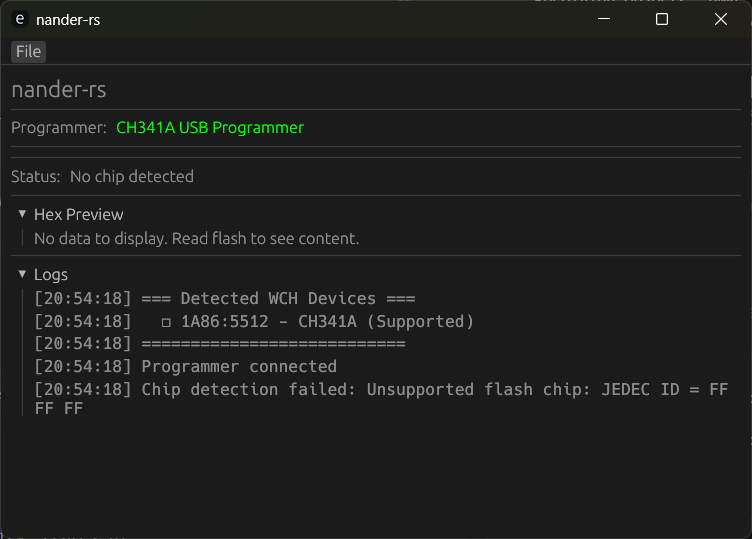

# nander-rs

🦀 **Modern SPI NAND/NOR Flash programmer written in Rust**

[](https://crates.io/crates/nander-rs)
[](https://docs.rs/nander-rs)
[](LICENSE-MIT)

A complete rewrite of [SNANDer](https://github.com/McMCCRU/SNANDer) in Rust, designed for maximum portability and reliability.

## ✨ Features

- 🔌 **Pure Rust USB** - No `libusb` DLL required
- 🖥️ **Cross-platform** - Windows, Linux, macOS
- 📦 **Single binary** - No runtime dependencies
- 🛡️ **Memory safe** - Rust's ownership system
- 🎨 **GUI & CLI** - Graphical and command-line interfaces
- 🔧 **Extensible** - Trait-based architecture

## 📦 Installation

```bash
cargo install nander-rs
```

## 🚀 Quick Start

```bash
# Test programmer connection
nander diagnostic

# Detect flash chip
nander info

# Read flash
nander read -o backup.bin

# Write flash
nander write -i firmware.bin

# Launch GUI
nander gui
```



## 📖 Documentation

| English | 中文 |
|---------|------|
| [Quick Start](https://github.com/Tinnci/nander-rs/wiki/En-Quick-Start) | [快速入门](https://github.com/Tinnci/nander-rs/wiki/Zh-Quick-Start) |
| [CLI Reference](https://github.com/Tinnci/nander-rs/wiki/En-CLI-Reference) | [命令行参考](https://github.com/Tinnci/nander-rs/wiki/Zh-CLI-Reference) |
| [Troubleshooting](https://github.com/Tinnci/nander-rs/wiki/En-Troubleshooting) | [故障排除](https://github.com/Tinnci/nander-rs/wiki/Zh-Troubleshooting) |

👉 **[Full Documentation / 完整文档](https://github.com/Tinnci/nander-rs/wiki)**

## 🛠 Supported Hardware

### Programmers
- **CH341A** - USB SPI programmer (fully supported)

### Flash Types
- **SPI NAND** - With OOB and bad block management
- **SPI NOR** - Standard JEDEC SPI NOR
- **I2C EEPROM** - 24Cxx series
- **SPI EEPROM** - 25xxx series
- **Microwire EEPROM** - 93Cxx series

## ⚠️ Windows Users

If you see a driver error, you need to install WinUSB driver using [Zadig](https://zadig.akeo.ie/). 

See: [Windows Driver Fix](https://github.com/Tinnci/nander-rs/wiki/En-Troubleshooting#windows-driver-issues)

## 📄 License

Licensed under either of:
- Apache License, Version 2.0 ([LICENSE-APACHE](LICENSE-APACHE))
- MIT License ([LICENSE-MIT](LICENSE-MIT))

**Note**: This is a clean-room implementation. While inspired by SNANDer's functionality, `nander-rs` contains no GPL-licensed code.

## 🙏 Acknowledgments

- **[SNANDer](https://github.com/McMCCRU/SNANDer)** by McMCC - Original C implementation
- The Rust embedded community
